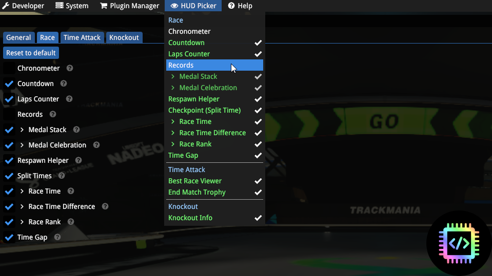

# [HUD Picker](https://openplanet.dev/plugin/hudpicker)

## Pick which HUD elements you want to see (DOES NOT work when hide interface enabled)

---

## Features
- Choose which UI elements you wish to see during a race
- Can select options from the settings menu or menubar dropdown

Additional UI elements can be added (contact me on the Openplanet discord)

## Changelog

### v2.1
- add null check in order to prevent game from crashing

### v2.0
- major refactor to set elements as classes and remove repetitive code
- added ability to toggle sub-views (requested by Inspeired and IamPd)
- added option to move dropdown menu location for ease of access

### v1.1
- signed for all users to be able to utilize
- added countdown to hud options

### v1.0
- Initial Release

